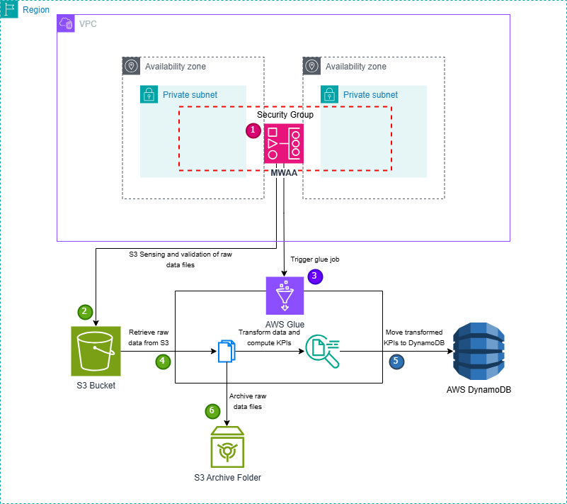

# ETL Pipeline with Apache Airflow, AWS Glue, and DynamoDB  

## Overview  
This ETL pipeline is designed to process streaming data for a **music streaming service** using **Apache Airflow (MWAA)** and **AWS Glue**. The pipeline extracts streaming data from **Amazon S3**,validates it’s files and columns, processes it using **AWS Glue** (PySpark) to compute key streaming KPIs, and loads the transformed data into **Amazon DynamoDB** for real-time querying.

## Architecture Overview  

### **Components Used**  
- **AWS S3** → Stores raw and processed streaming data.  
- **Apache Airflow (MWAA)** → Manages the ETL workflow using DAGs.  
- **AWS Glue** → Handles ETL transformations with PySpark.
- **Amazon DynamoDB** → Stores KPI metrics for fast access.  
- **AWS IAM Roles** → Ensures secure access control for Glue and Airflow. 

### **Pipeline Flow**  
1. **S3 Sensor** → Airflow detects new files in **S3** (`raw-data/` and `raw-data/streams/`).  
2. **Validation** → Ensures required files exist and checks column integrity.  
3. **AWS Glue Processing** → Cleans and transforms rawdata, computes KPIs, and writes results to **DynamoDB**.  
4. **Archival Process** → Moves processed files to `archive/raw-data/{date}/`.  

### **Architecture Diagram**  


---

## **Airflow DAG Implementation**  
### **DAG Overview**  
**Triger** → On detecting new files in S3 (`raw-data/` and `raw-data/streams/`).

### **Tasks in the DAG**  
1. **S3 Sensor** → Monitors `raw-data/` and `raw-data/streams/` for new CSV files.  
2. **Validation Task** → Ensures correct column structure.  
3. **AWS Glue Job Execution** → Triggers the Glue job to transform and load data.  
4. **Archival Task** → Moves processed files to an archive directory in S3.

### **Key Implementations**
a. **S3 Sensor** - Monitors raw-data/ and raw-data/streams/ for new CSV files.
b. **File Validation** - Checks for the existence of `users.csv`, `songs.csv`, and `streams.csv` and ensures files have required columns. 
c. **AWS Glue Job Execution** - Triggers Glue job for processing and DynamoDB ingestion.
d. **File Archival** - Moves processed files to an archive directory in S3.

---

## **AWS Glue Job Implementation**  
### **Key Transformations in PySpark**  
✔ Reads user, song, and stream data from S3.  
✔ Validates and cleans raw data.  
✔ Computes streaming **KPIs** using PySpark.  
✔ Writes processed data into **DynamoDB**.  

---

## **Logging & Error Handling**  
- **Detailed logging** at every step for debugging.  
- **Error handling** in AWS Glue to prevent failures.  
- **Retries enabled** in Airflow tasks for fault tolerance.  

---

## **DynamoDB Schema & Queries**  

### **Tables in DynamoDB**  
| Table Name  | Description  |  
|-------------|-------------|  
| `GENRE_KPIS` | Aggregated metrics per genre per day. |  
| `TOP_SONGS`  | Top 3 most listened-to songs per genre. |  
| `TOP_GENRES` | Top 5 most popular genres per day. |  

### **Sample Query: Fetch Top 5 Genres for a Date**  
```sql
SELECT * FROM "TOP_GENRES"  
WHERE "date" = '2024-03-21'  
ORDER BY "listen_count" DESC  
LIMIT 5;
```

---

## **Deployment in MWAA**

- The DAG is deployed on **Amazon Managed Workflows for Apache Airflow (MWAA)**
for orchestration.
- **IAM roles** and **security policies** are configured to ensure secure access to AWS services.
- **S3 bucket storage** is used for intermediate data storage and DAG scripts.

---

## **Conclusion**
This ETL pipeline successfully automates data ingestion & validation with **Apache Airflow**, transforms streaming data with **AWS Glue & PySpark**, computes key KPIs & writes to **Amazon DynamoDB** and implements logging & error handling, and ensures data archival.